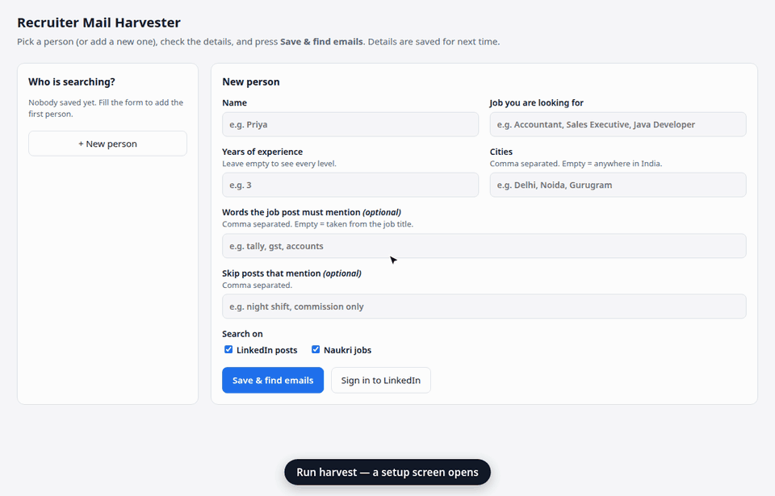
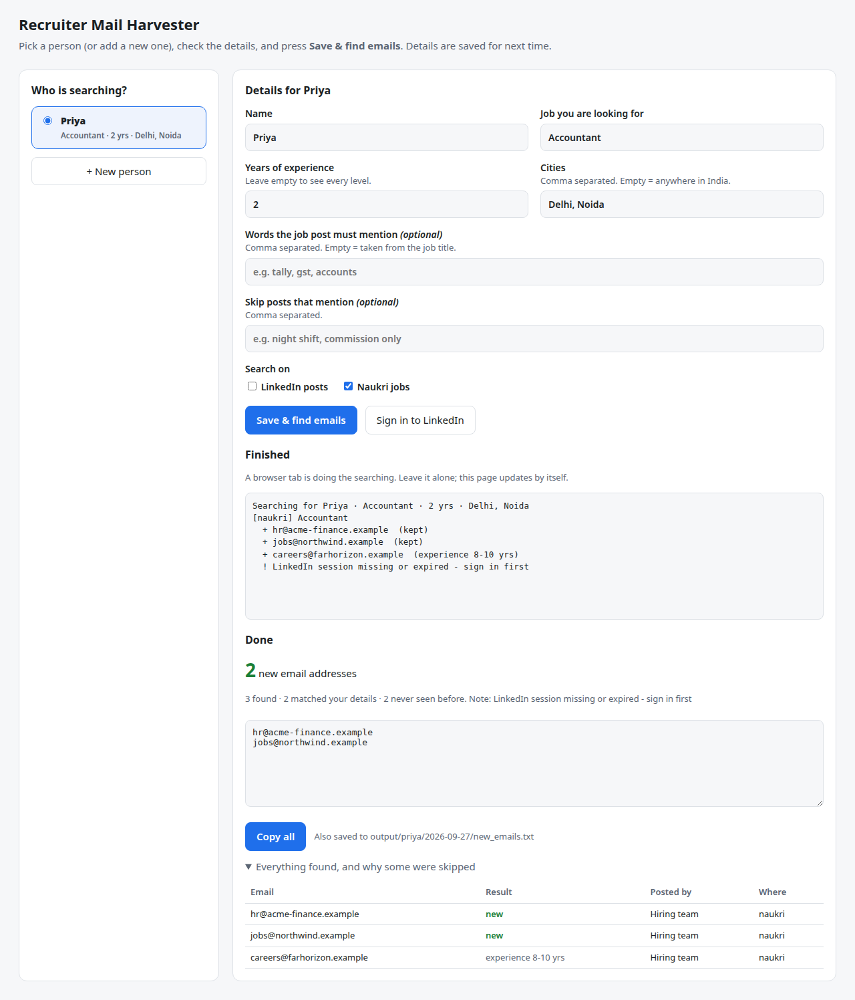

# Recruiter Mail Harvester

**Find recruiter email addresses for the job *you* want, from LinkedIn hiring posts and Naukri job descriptions. You fill a short form once. Next time you just tick your name and press a button.**

It works for any job: accountant, sales executive, teacher, HR, QA engineer, Java developer. It runs on your own computer, uses your own browser, and needs no paid service, API key or account with this project.



*The demo uses a simulated search with made-up `.example` addresses.*

---

## What it does

Recruiters post things like *"Hiring Accountant, Tally/GST, 1-3 yrs, Noida, share your CV at hr@company.com"* all day. Collecting those by hand means opening dozens of posts, clicking "…more", copying addresses, skipping jobs that need 12 years or are in the wrong city, and remembering whom you already wrote to.

This tool does that for you:

1. **You describe what you want**: job title, years of experience, cities. The details are saved.
2. **It searches** LinkedIn posts from the last 24 hours and today's Naukri jobs for that title, in a real Chrome window.
3. **It keeps only matching posts**: right job, right experience range, right city. It skips job seekers, US staffing agencies, "job support" spam and jobs abroad.
4. **It shows the new addresses** with a *Copy all* button. It also saves them to a text file, and remembers them so they are never shown as new again.

## Install

You need **Python 3.11 or newer** and **Google Chrome**.

```bash
git clone https://github.com/pankajsharma21/recruiter-mail-harvester.git
cd recruiter-mail-harvester
python3 -m venv .venv
.venv/bin/pip install -e .
```

On Windows, use `python` instead of `python3` and `.venv\Scripts\` instead of `.venv/bin/`.

Playwright uses the Chrome already on your computer, so no extra browser is downloaded.

## Use

```bash
.venv/bin/harvest
```

A Chrome window opens with the setup screen.

- **First time:** fill in your name, the job you want, experience and cities. Press **Sign in to LinkedIn** once, sign in yourself, and the tab closes on its own. Then press **Save & find emails**.
- **Next time:** your name is already in the list and ticked. Press **Save & find emails**.
- **Someone else:** press **+ New person** and fill in their details. Everyone's details, history and results are kept separately.

A second tab does the searching, which takes a few minutes, and the screen fills in as it goes. When it finishes you get the new addresses, a **Copy all** button, and a table of everything found with the reason each skipped one was skipped.

The addresses are also saved to `output/<name>/<date>/new_emails.txt`.



### Form fields

| Field | What it does | Example |
|---|---|---|
| Name | Whose details these are | Priya |
| Job you are looking for | Used for the searches and to check each post | Accountant |
| Years of experience | Hides posts asking for a range you are far from ("8-10 yrs" when you have 2). One year of slack either way. Posts that don't say are kept. Leave empty to see all. | 2 |
| Cities | Hides posts naming only other cities. Gurgaon = Gurugram, Bangalore = Bengaluru. "Remote" and posts with no city are kept. Leave empty for anywhere. | Delhi, Noida |
| Words the post must mention | Optional. Leave empty and the job title is used. | tally, gst, accounts |
| Skip posts that mention | Optional deal-breakers | commission only, night shift |
| Search on | LinkedIn posts, Naukri jobs, or both | |

## Good to know

- **Your password is never seen by this tool.** You sign in to LinkedIn yourself, in the tool's own Chrome profile (`~/.local/share/recruiter-mail-harvester/profile`). Your everyday Chrome is not touched.
- **Run it about once a day.** LinkedIn limits automated use and returns fewer results after several searches in a row. Heavy use can get an account restricted.
- **Leave the search tab alone** while it works. Naukri refuses hidden (headless) browsers, so the window has to stay visible.
- **Most Naukri jobs have no email in them.** In testing, about 2 in 30 did. LinkedIn posts are the richer source.
- The addresses belong to real people. Use them to apply for the jobs they posted, and don't share or sell them. They stay on your computer: `profiles/`, `data/` and `output/` are git-ignored.

## For power users: the command line

Everything the screen does is also a command:

| Command | What it does |
|---|---|
| `harvest` | Opens the setup screen (same as `harvest ui`) |
| `harvest run -p priya` | Searches with a saved person's details, no screen. Without `-p`, uses the last person. |
| `harvest run -p priya --sources naukri --limit 10` | One portal only, 10 posts per search |
| `harvest login` | Sign in to LinkedIn without the screen |
| `harvest init` | Create a person by answering questions in the terminal |
| `harvest profiles` | List saved people |
| `harvest scan file.txt -p priya` | Pull addresses out of any pasted text (a WhatsApp forward, an email) and filter them. No browser. |
| `harvest export --days 1 -p priya` | Addresses first seen in the last N days, one per line, for piping into a mailer |

The screen saves each person to `profiles/<name>.toml`, which you can also edit by hand. Ready-made examples, both IT and non-IT, are in [`examples/profiles/`](examples/profiles): accountant, sales executive, QA engineer, product manager, Java developer.

```toml
[profile]
name = "Example: Accountant"
role = "Accountant"
experience_years = 2
locations = ["Delhi", "Noida"]
skills = ["accountant", "accounts", "tally", "gst"]
exclude_keywords = ["commission only"]
linkedin_queries = []     # empty = made from the job title
naukri_queries = []
sources = ["naukri", "linkedin"]
```

Rules that apply to everyone are in [`config.toml`](config.toml): how many posts to read per search, and the labelled patterns that drop US staffing posts, jobs abroad, job seekers and "job support" spam. Every skipped address is saved with the rule *and the words that triggered it*, for example `experience 8-12 yrs`, `location hyderabad` or `job seeker: "#OpenToWork"`. A rule that misfires is easy to spot.

## How it works

```
setup screen (or profile file)
        │  job, experience, cities
        ▼
┌──────────────┐   ┌──────────────┐   ┌────────────────────┐   ┌──────────────┐
│  Playwright  │──►│   extract    │──►│      filter        │──►│   SQLite     │──► screen + new_emails.txt
│  (your       │   │  emails,     │   │  job words         │   │  per-person  │
│   Chrome)    │   │  [at]/[dot]  │   │  experience range  │   │  history:    │
│ LinkedIn     │   │  decoding    │   │  city              │   │  only NEW    │
│ Naukri       │   │              │   │  spam / abroad /   │   │  reported    │
│              │   │              │   │  job seekers       │   │              │
└──────────────┘   └──────────────┘   └────────────────────┘   └──────────────┘
```

```
harvester/
├── ui.py / ui.html   # the setup screen, shown in the same Chrome window
├── cli.py            # commands, search loop, CSV / text output
├── profile.py        # a person: searches, experience + city checks, TOML file
├── browser.py        # the tool's own persistent Chrome profile (Playwright)
├── extract.py        # email regex, [at]/[dot] decoding, junk filtering
├── filters.py        # shared rules: job words, labelled drop patterns, blocklists
├── store.py          # SQLite history: "is this address new for this person?"
└── sources/
    ├── linkedin.py   # content search → scroll → expand "…more" → posts
    └── naukri.py     # job search → open each job → description
examples/profiles/    # sample people, IT and non-IT
scripts/              # record_demo.py + build_gif.py: regenerate docs/demo.gif
tests/                # 26 tests, no network needed
```

The screen is plain HTML shown in the Chrome window Playwright already drives. It talks to Python through Playwright's exposed functions, so there is no web server and no GUI toolkit to install, and it looks the same on Linux, Windows and macOS.

Adding a job portal means one new file in `sources/` with an async `posts(page, query, limit)` generator that yields `Post` objects. Extraction, filtering, history and the screen are shared.

## Tests

```bash
.venv/bin/pip install -e '.[dev]'
.venv/bin/pytest -q
```

The tests cover plain and obfuscated addresses, junk rejection (`logo@2x.png`, `noreply@`), experience parsing, city aliases, one post judged differently by two people, non-IT examples (accountant, sales), profile files round-tripping, and every drop rule. Some tests reproduce real mistakes seen in live runs: a recruiter post reshared by someone "Open to Work", `qa` matching "Qatar", and `USA` matching "Virtusa".

## Things learned while building it

- **Naukri refuses headless Chrome.** Its CDN answers with a bare "Access Denied" page. The tool detects that page and says so, instead of reporting "0 jobs".
- **LinkedIn lazy-loads only on real scroll events.** `window.scrollTo()` loads nothing new. Playwright's `mouse.wheel()` does.
- **The address is usually in the truncated part of a post**, so every "…more" button is clicked before reading.
- **The avatar link comes first.** A post's first profile link wraps the photo and has no text, so the author is the first link that does.
- **LinkedIn signs in with client-side navigation**, so waiting for a page-load event never fires. Sign-in polls the URL instead.
- **Showing the matched words paid off at once.** Real recruiters were being dropped as "job seekers" because of an "Open to Work" badge on a reshare. The reason column made that obvious.

## License

MIT
